::: {.hero-banner}
# West Coast Neuroecon 2026

### Annual Symposium

**May 1, 2026** | Luskin Conference Center, UCLA
:::

::: {.intro-text}
The West Coast Neuroeconomics Symposium brings together decision scientists from across the West Coast and beyond. Join us for a day of cutting-edge research, collaboration, and discussion on the mechanisms underlying decision-making.
:::

---

## Keynote Speaker

::: {.grid}
::: {.g-col-12 .g-col-md-3}
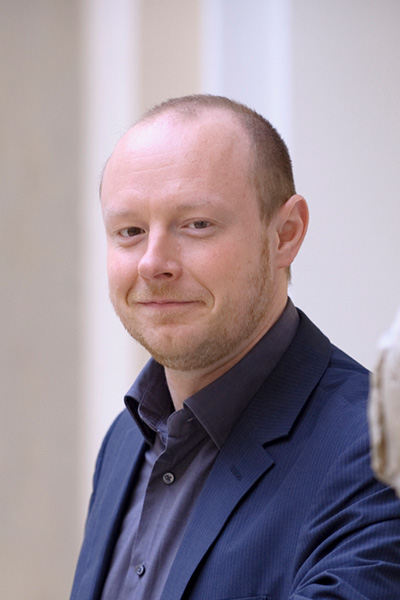{style="width: 140px; height: 140px; object-fit: cover; border-radius: 50%;"}
:::
::: {.g-col-12 .g-col-md-9}
### Prof. Christian Ruff, PhD

**University of Zurich** | Professor of Neuroeconomics and Decision Neuroscience

Prof. Ruff's research focuses on human motivation, decision-making, and learning, combining behavioral experiments and computational modeling with neuroimaging and brain stimulation.

[Faculty Profile](https://www.econ.uzh.ch/en/people/faculty/ruff.html) | [Google Scholar](https://scholar.google.com/citations?user=yY3StJ8AAAAJ)
:::
:::

---

## Featured Speakers

::: {.speaker-grid}
::: {.speaker-card}
{.speaker-img}
Ming Hsu
:::
::: {.speaker-card}
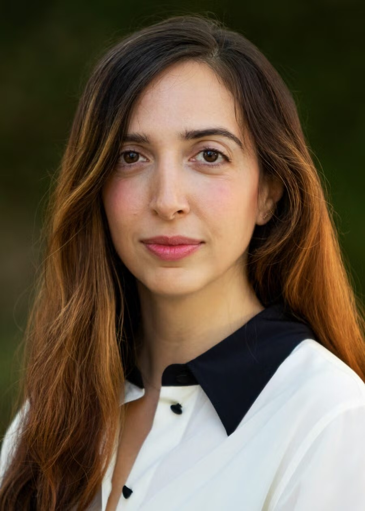{.speaker-img}
Nina Rouhani
:::
::: {.speaker-card}
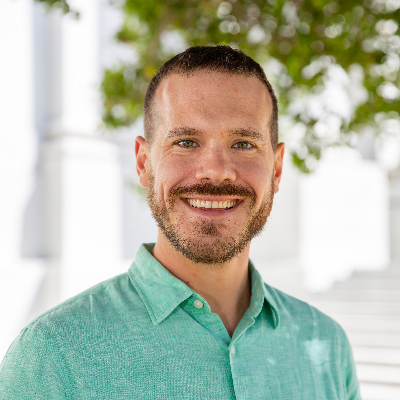{.speaker-img}
Ian Ballard
:::
::: {.speaker-card}
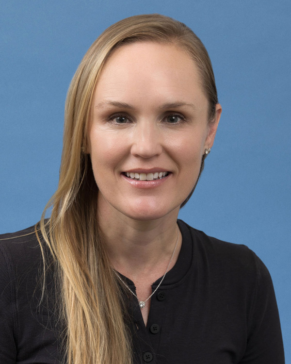{.speaker-img}
Kate Wassum
:::
::: {.speaker-card}
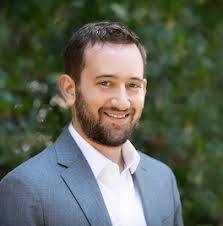{.speaker-img}
Leor Hackel
:::
::: {.speaker-card}
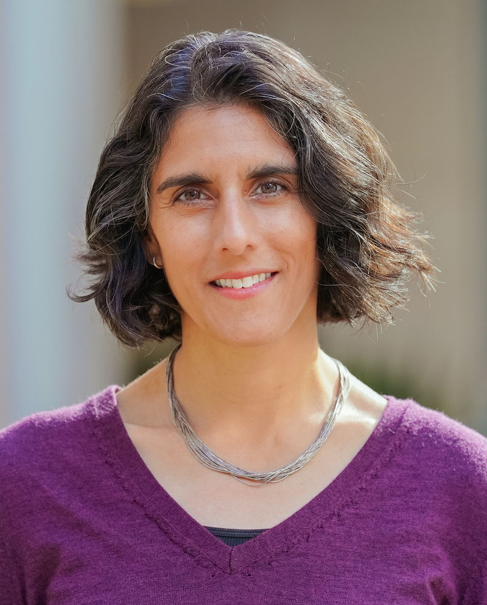{.speaker-img}
Uma R. Karmarkar
:::
::: {.speaker-card}
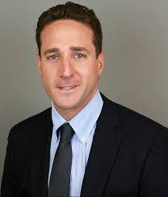{.speaker-img}
Cary Frydman
:::
::: {.speaker-card}
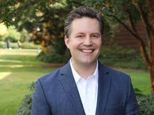{.speaker-img}
John A. Clithero
:::
::: {.speaker-card}
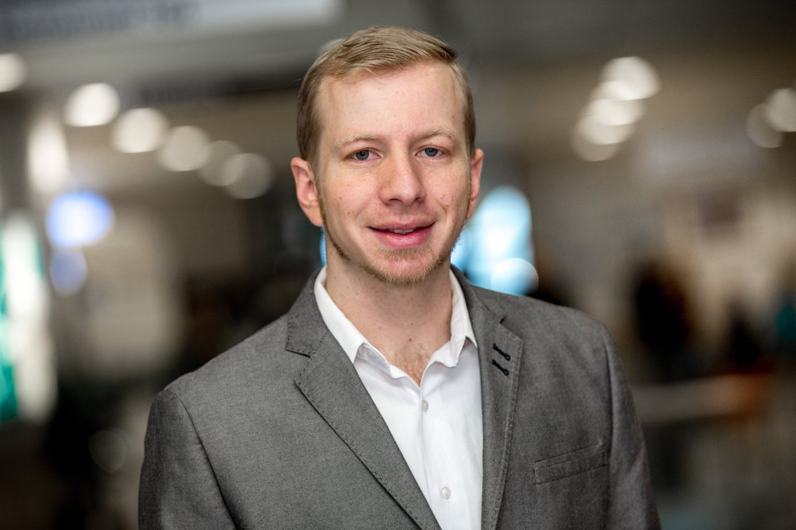{.speaker-img}
Dan Schley
:::
:::

---

## Program — Friday, May 1

| Time | Session |
|------|---------|
| 10:00 - 10:25 AM | **Ming Hsu** — Open-ended decision making: Because life is not a multiple choice test |
| 10:25 - 10:50 AM | **Nina Rouhani** — Features and dynamics of social inference in real-world interactions |
| 10:50 - 11:15 AM | **Ian Ballard** — Cue-Driven Disruption of Goal-Directed Behavior by Social Media Habits |
| 11:15 - 11:45 AM | Coffee Break |
| 11:45 - 12:10 PM | **Kate Wassum** — Brain mechanisms of reward learning and decision making |
| 12:10 - 12:35 PM | **Leor Hackel** — Learning Who Values Us: Neural Computations Linking Social Feedback to Affiliation |
| 12:35 - 1:35 PM | Lunch |
| 1:35 - 2:20 PM | **Plenary: Christian Ruff** — Neurocomputational Underpinnings of Altered Mentalization in Autism |
| 2:20 - 2:45 PM | **Uma R. Karmarkar** — More Paths to Unlikelihood: When knowing More Creates the Perception of Less |
| 2:45 - 3:10 PM | **Cary Frydman** — Cognitive imprecision and strategic interactions |
| 3:10 - 3:40 PM | Coffee Break |
| 3:40 - 4:05 PM | **John A. Clithero** — Knowledge Diffusion of Psychology and Neuroscience in Consumer Research |
| 4:05 - 4:30 PM | **Dan Schley** — Perceiving Before Choosing: A Domain-General Model of Bounded Rationality |
| 4:30 - 4:45 PM | Closing Remarks |
| 6:00 PM | Dinner (invitation only) |

---

## Venue

::: {.important-box}
**Meyer & Renee Luskin Conference Center**

425 Westwood Plaza, UCLA, Los Angeles, CA 90095

[Luskin Conference Center Website](https://luskinconferencecenter.ucla.edu/)
:::

**Getting There:** Fly into LAX (13 miles) or Burbank (20 miles). UCLA is accessible via I-405 (exit Wilshire or Sunset Blvd).

**Accommodations:** The Luskin Conference Center has 254 guest rooms on-site. Additional hotels available in Westwood Village and Santa Monica.

---

## Registration

Registration is free. [Register here](https://forms.gle/qsXzPKDpUPiYEhgcA)

---

## Organizers

::: {.organizer-grid}
::: {.organizer-card}
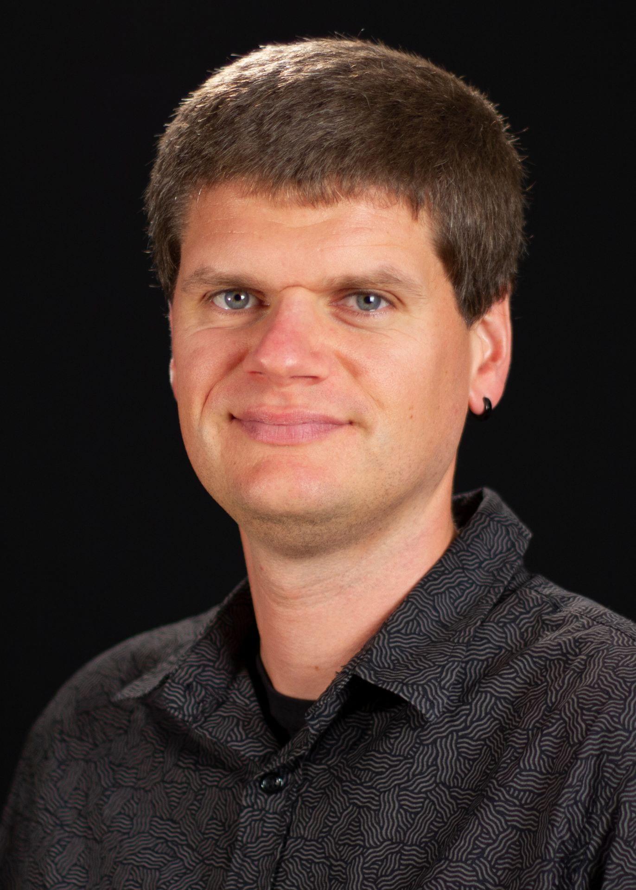{style="width: 120px; height: 120px; object-fit: cover; object-position: center top; border-radius: 50%;"}

**Ian Krajbich**

UCLA | [Lab Website](https://krajbichlab.psych.ucla.edu/people/)
:::
::: {.organizer-card}
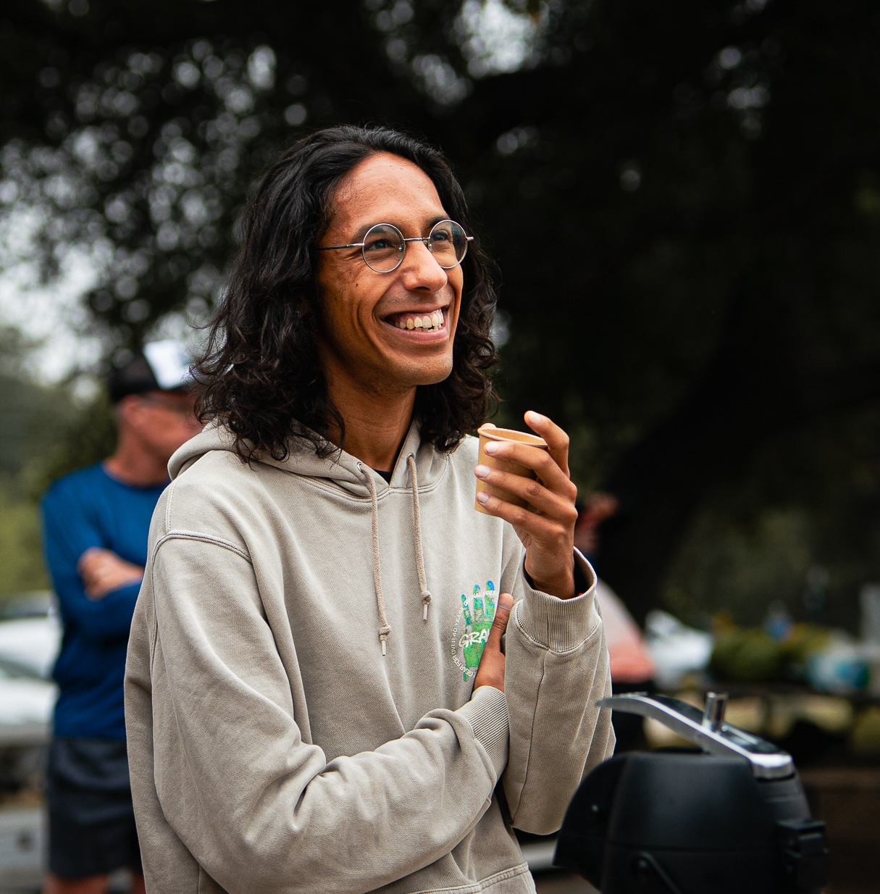{style="width: 120px; height: 120px; object-fit: cover; border-radius: 50%;"}

**Kianté Fernandez**

UCLA | [CV](https://www.kiantefernandez.com/files/cv.pdf)
:::
:::

---

## Sponsors

::: {.card style="padding: 1.25rem;"}
**The Luskin Lecture for Thought Leadership**

Generously supported by Meyer and Renee Luskin. [Learn more](https://www.college.ucla.edu/luskinthoughtlecture/about-the-luskin-lecture/)
:::

---

::: {.info-box}
**Questions?** Contact us at [wcneuroecon@gmail.com](mailto:wcneuroecon@gmail.com)
:::
